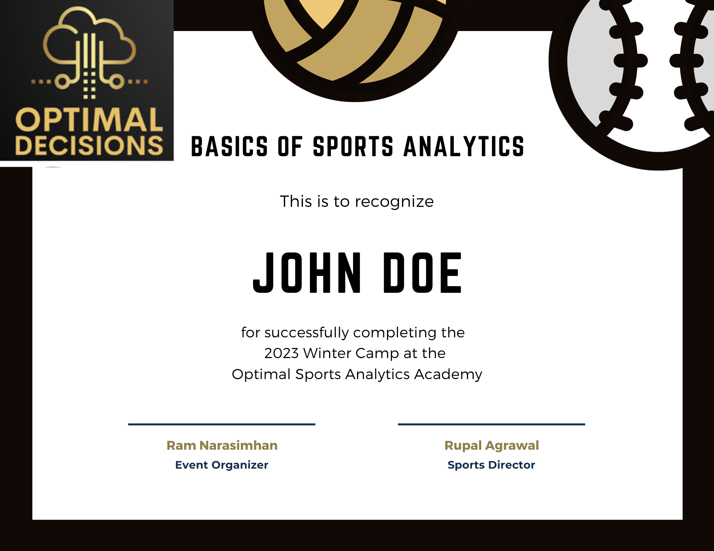

**Start: 15 December 2023**

**End: 30 Jan 2024**

The sports analytics camp is a learning opportunity that focuses on data science concepts, probability, predictive analytics, data exploration, and basic visualization, all within the context of sports. It is designed for individuals who are interested in improving their Python skills, high school students looking to showcase a project for college applications, and anyone with a passion for sports and numbers.

### Purpose
The camp aims to provide a safe and easy way for individuals to explore their interest in sports and numbers while learning valuable data science skills. It also offers an opportunity for high school students to showcase a project for college applications.

### How It Works
The camp offers interactive sessions, lectures, and office hours, with approximately two online sessions per week covering programming, tech skills, analysis concepts, and sports-related questions. It is a self-paced program that requires a commitment of at least 8 hours per week for independent work. The camp is open book and encourages participants to use any available resources for learning. An optional keystone project allows participants to work on an individual capstone project, with the opportunity to showcase their work and receive a certificate upon completion.

### Who Is It For
The camp is suitable for individuals who:
Want to improve their Python skills in a fun and practical way
Are high school students looking to showcase a project for college applications
Have an interest in sports and numbers and want to explore this passion while learning new skills

### Certificate

If you complete a Sports Analytics keystone project by the end of January 2024, you will be awarded a certificate. This certificate is a recognition of your dedication and achievement in the field of sports analytics.

### Quick Summary 
- In this camp, there are no tests, exams, or preparations needed. It is not competitive, and participants have different learning goals.
- The camp will utilize Colab, which runs on the Cloud, for data analysis and statistical programming.
- Participants will find and download data related to their sport of choice, and this process can be done together.
- While the camp will try to stay away from sports betting, sometimes the data and insights from such analyses can be useful.
- The camp is an opportunity to "tinker" with data, stats, and plots related to any sport that participants love.
- An optional capstone project will be available, where participants will work on a small analytics project in their sport of choice.
- The goal of the capstone project is to showcase it, which can be done through a GitHub account, a website, or by writing a "white paper."
- Participants who attend the interactive sessions and complete a capstone sport data analysis project will receive a certificate for completing the **"Basics of Sports Analytics"** course.

For more information and to sign up, you can contact Ram at ramnarasimhan@gmail.com.

