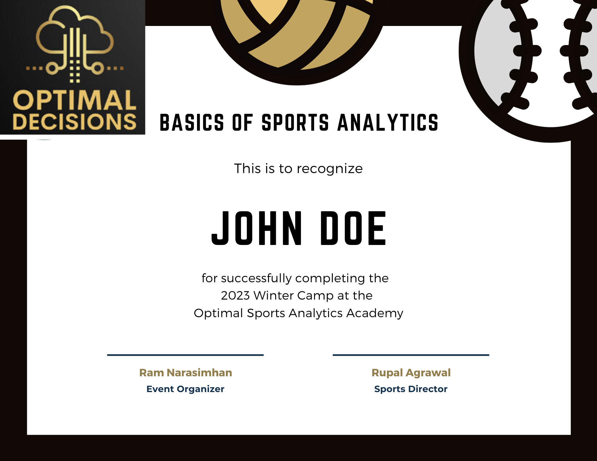

## Optimal Sports Analytics Academy 

The Sports Analytics Academy aims to harness the innate interest in Sports and Games that people have, and to channel that interest to learn 
core skills around 
- Technology
- Programming
- Logical reasoning
- Decision-making 
- Story-telling 
- Communications

### Target Audience

The classes, courses and sessions of the Sports Analytics academy are aimed at students -- middle school, high school, college, graduate students and hobbyists who want to learn coding or analysis techniques.

### Courses Offered

    - Basics of Sports Analytics (4-6 weeks, with capstone project)
    - Basic Machine Learning Applied to Sports Analytics (1-2 weeks)
    - Visualization in Sports Analytics (1-2 weeks)
    - Intermediate Sports Analytics (4-6 weeks, with capstone project)
    - Advance Analytics (Project-based, self-paced with mentors assisting)

### Certificates

Upon successful completion of any Course (made up of several modules), a certificate is issued to the participant.

**Important Note** 
**About Making Sports Analytics as one's Career** 
At the academy, we believe that while analyzing data (from any sport) can be a source of great fun and full of insights, it is *not* a particularly good career choice. The field is over-crowded. Due to the high interest and demand, the salaries and compensations tend to be lower, compared to other fields that require comparable skills. There are 100s of people willing to do these tasks "for free." So choose wisely.

Participants taking courses with the academy will learn a vast array of skills that will help them in other analytics-oriented careers.

[Contact]((mailto:ramnarasimhan@gmail.com?&subject=Winter2023 Interest in SA Academy courses))