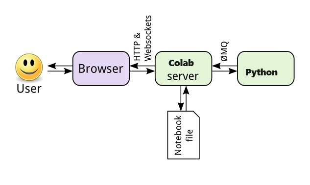

## Tech Stack Related questions

Q: **What is Colab? And how is different from Jupyter Notebook?**

**Response:**

- Google Colab, is best suited for those who need to collaborate with others in real-time or who need access to a GPU or TPU. Plus it runs on the Cloud, so it is much easier to get going with Colab.
- Jupyter Notebook is best suited for those who need full control over their environment and who want to work locally. 

This table explains it well: [Reference](https://gist.githubusercontent.com/jayalath-jknr/8218fe4c1dbcae688eb911d60cdebdb5/raw/8f3a7e9d47989ed002560ea92d361590365985ec/Jupyter-vs-Google%20Collabs.md)

{:.thead-dark .table-striped .table-bordered .table-sm }
| Feature | Jupyter Notebook | Google Colab |
| ------- | ---------------- | ------------ |
| Environment | Runs locally on a user's machine | Cloud-based environment accessible from any device |
| Collaboration | Limited | Real-time collaboration with multiple users on a single notebook |
| Computing Power | Depends on the user's local machine | Access to high-end CPUs, GPUs, and TPUs through Google Cloud |
| Pre-installed Libraries | Some pre-installed libraries with Anaconda distribution | Many popular libraries pre-installed |
| Integration with External Services | Possible through external packages | Built-in integration with Google Drive, Google Sheets, and GitHub |
| Cost | Free and open-source | Free with limitations, paid version available |

Q: **What is the relationship between Colab and Python?**

**Response:**

This picture might help a little:

In short, Colab is an *interface* (inside the web broswer) via which we access Python, which runs the commands and returns results. In other words, Colab sits between your broswer and the Python *kernel* and helps us "communicate" with the Python back end.

